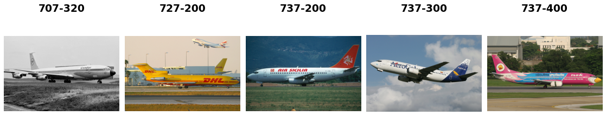

FGVC Aircraft
=============

.. raw:: html

   

   
   
   
   

Overview
--------

Fine-Grained Visual Classification of Aircraft (FGVC-Aircraft) is a benchmark dataset for fine-grained visual categorization of aircraft. The dataset contains 10,000 images of aircraft with hierarchical labels organized in three levels of granularity.

Aircraft models are organized in a three-level hierarchy:

- **Variant** (finest): 100 fine-grained aircraft model variants (e.g., "Boeing 737-700")
- **Family** (medium): 70 aircraft families (e.g., "Boeing 737")
- **Manufacturer** (coarsest): 30 aircraft manufacturers (e.g., "Boeing")

The dataset is divided into three equally-sized splits:

- **Train**: 3,334 images
- **Validation**: 3,333 images
- **Test**: 3,333 images

Images are about 1-2MP resolution. Each image has a 20-pixel copyright banner at the bottom that is automatically removed during loading.

Dataset Configurations
----------------------

The dataset supports three classification granularities:

**Variant Configuration (Default)**

- 100 classes representing fine-grained aircraft model variants
- Most challenging task with visually similar models
- Example classes: "Boeing 737-700", "Boeing 737-800", "A380", "Cessna 172"

**Family Configuration**

- 70 classes representing aircraft families
- Groups variants of the same family together
- Example classes: "Boeing 737", "A320", "Cessna Citation"

**Manufacturer Configuration**

- 30 classes representing aircraft manufacturers
- Coarsest granularity, groups all models by manufacturer
- Example classes: "Boeing", "Airbus", "Cessna", "Embraer"

Data Structure
--------------

When accessing an example using ``ds[i]``, you will receive a dictionary with the following keys:

.. list-table::
   :header-rows: 1
   :widths: 20 20 60

   * - Key
     - Type
     - Description
   * - ``image``
     - ``PIL.Image.Image``
     - Variable resolution RGB aircraft image (copyright banner removed)
   * - ``label``
     - int
     - Class label. Range depends on config: 0-99 for variant, 0-69 for family, 0-29 for manufacturer

Usage Example
-------------

**Basic Usage (Default Variant Configuration)**

.. code-block:: python

    from stable_datasets.images.fgvc_aircraft import FGVCAircraft

    # Load variant configuration (100 classes, finest granularity)
    ds_train = FGVCAircraft(config_name="variant", split="train")
    ds_val = FGVCAircraft(config_name="variant", split="validation")
    ds_test = FGVCAircraft(config_name="variant", split="test")

    # Or use default (variant)
    ds_train = FGVCAircraft(split="train")

    sample = ds_train[0]
    print(sample.keys())  # {"image", "label"}

    # Optional: make it PyTorch-friendly
    ds_torch = ds_train.with_format("torch")

**Using Different Configurations**

.. code-block:: python

    from stable_datasets.images.fgvc_aircraft import FGVCAircraft

    # Family configuration (70 classes)
    ds_family = FGVCAircraft(config_name="family", split="train")
    print(f"Family classes: {len(ds_family.features['label'].names)}")  # 70

    # Manufacturer configuration (30 classes)
    ds_manufacturer = FGVCAircraft(config_name="manufacturer", split="train")
    print(f"Manufacturer classes: {len(ds_manufacturer.features['label'].names)}")  # 30

    # Get class name from label
    sample = ds_family[0]
    label_idx = sample['label']
    class_name = ds_family.features['label'].names[label_idx]
    print(f"Label index: {label_idx}, Class name: {class_name}")

**Loading All Splits**

.. code-block:: python

    from stable_datasets.images.fgvc_aircraft import FGVCAircraft

    # Get a DatasetDict with all splits
    ds_all = FGVCAircraft(config_name="variant", split=None)
    print(ds_all.keys())  # dict_keys(['train', 'validation', 'test'])

    train_ds = ds_all["train"]
    val_ds = ds_all["validation"]
    test_ds = ds_all["test"]

References
----------

- Official website: https://www.robots.ox.ac.uk/~vgg/data/fgvc-aircraft/
- Paper: https://arxiv.org/abs/1306.5151
- Dataset download: https://www.robots.ox.ac.uk/~vgg/data/fgvc-aircraft/archives/fgvc-aircraft-2013b.tar.gz

Citation
--------

.. code-block:: bibtex

    @techreport{maji13fine-grained,
      title         = {Fine-Grained Visual Classification of Aircraft},
      author        = {S. Maji and J. Kannala and E. Rahtu and M. Blaschko and A. Vedaldi},
      year          = {2013},
      archivePrefix = {arXiv},
      eprint        = {1306.5151},
      primaryClass  = {cs.CV}
    }
