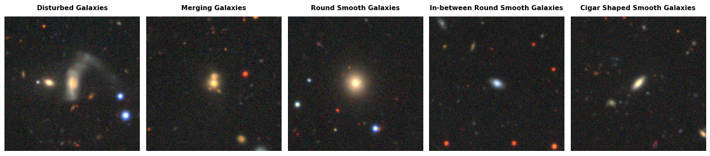

Galaxy10 DECaLS
===============

.. raw:: html

   

   
   
   
   

Overview
--------

Galaxy10 DECaLS is a galaxy morphology classification dataset containing 17,736 256×256 pixel colored galaxy images (g, r, and z band) separated into 10 classes. It is a much improved version of the original Galaxy10 dataset.

The images come from DESI Legacy Imaging Surveys (DECaLS) with much better resolution and image quality than the original SDSS images. Labels come from Galaxy Zoo volunteer classifications. The dataset was created by combining Galaxy Zoo Data Release 2 with DECaLS images and DECaLS campaign a/b and c, resulting in ~441k unique galaxies covered by DECaLS where ~18k images were selected in 10 broad classes using volunteer votes with more rigorous filtering.

- **Total samples**: 17,736 images
- **Note**: This dataset does not have pre-defined train/test splits. Users should manually split the data as needed.

Galaxy Classes
--------------

The dataset contains 10 galaxy morphology classes:

1. **Disturbed Galaxies** (1,081 images)
2. **Merging Galaxies** (1,853 images)
3. **Round Smooth Galaxies** (2,645 images)
4. **In-between Round Smooth Galaxies** (2,027 images)
5. **Cigar Shaped Smooth Galaxies** (334 images)
6. **Barred Spiral Galaxies** (2,043 images)
7. **Unbarred Tight Spiral Galaxies** (1,829 images)
8. **Unbarred Loose Spiral Galaxies** (2,628 images)
9. **Edge-on Galaxies without Bulge** (1,423 images)
10. **Edge-on Galaxies with Bulge** (1,873 images)

Data Structure
--------------

When accessing an example using ``ds[i]``, you will receive a dictionary with the following keys:

.. list-table::
   :header-rows: 1
   :widths: 20 20 60

   * - Key
     - Type
     - Description
   * - ``image``
     - ``PIL.Image.Image``
     - 256×256×3 RGB image (g, r, z bands)
   * - ``label``
     - int
     - Class label (0-9)
   * - ``ra``
     - float
     - Right Ascension in degrees [0, 360]
   * - ``dec``
     - float
     - Declination in degrees [-90, 90]
   * - ``redshift``
     - float
     - Redshift value (may be NaN or small negative due to measurement error)
   * - ``pxscale``
     - float
     - Pixel scale in arcseconds per pixel

Usage Example
-------------

**Basic Usage**

.. code-block:: python

    from stable_datasets.images.galaxy10 import Galaxy10Decal

    # Load the dataset (only "train" split available)
    ds = Galaxy10Decal(split="train")

    sample = ds[0]
    print(sample.keys())  # {"image", "label", "ra", "dec", "redshift", "pxscale"}

    # Access galaxy image and metadata
    image = sample["image"]  # PIL Image
    label = sample["label"]  # Galaxy morphology class (0-9)
    ra = sample["ra"]  # Right ascension
    dec = sample["dec"]  # Declination
    redshift = sample["redshift"]  # Redshift value

    # Optional: make it PyTorch-friendly
    ds_torch = ds.with_format("torch")

**Manual Train/Test Split**

Since Galaxy10 does not have pre-defined splits, you can create your own:

.. code-block:: python

    from stable_datasets.images.galaxy10 import Galaxy10Decal
    from sklearn.model_selection import train_test_split

    # Load full dataset
    ds = Galaxy10Decal(split="train")

    # Create train/test split (80/20)
    train_indices, test_indices = train_test_split(
        range(len(ds)), test_size=0.2, random_state=42, stratify=ds["label"]
    )

    train_ds = ds.select(train_indices)
    test_ds = ds.select(test_indices)

    print(f"Train size: {len(train_ds)}, Test size: {len(test_ds)}")

**Accessing Astronomical Metadata**

.. code-block:: python

    from stable_datasets.images.galaxy10 import Galaxy10Decal
    import numpy as np

    ds = Galaxy10Decal(split="train")

    # Filter galaxies with valid redshift measurements
    valid_redshift_indices = [
        i for i in range(len(ds)) 
        if not np.isnan(ds[i]["redshift"])
    ]

    print(f"Galaxies with valid redshift: {len(valid_redshift_indices)}")

References
----------

- Official documentation: https://astronn.readthedocs.io/en/latest/galaxy10.html
- Source code: https://github.com/henrysky/Galaxy10
- Dataset download: https://zenodo.org/records/10845026
- License: MIT License

Citation
--------

.. code-block:: bibtex

    @article{walmsley2020galaxy,
      title={Galaxy Zoo: probabilistic morphology through Bayesian CNNs and active learning},
      author={Walmsley, Mike and Smith, Lewis and Lintott, Chris and Gal, Yarin and Bamford, Steven and Dickinson, Hugh and Fortson, Lucy and Kruk, Sandor and Masters, Karen and Scarlata, Claudia and others},
      journal={Monthly Notices of the Royal Astronomical Society},
      volume={491},
      number={2},
      pages={1554--1574},
      year={2020},
      publisher={Oxford University Press}
    }
